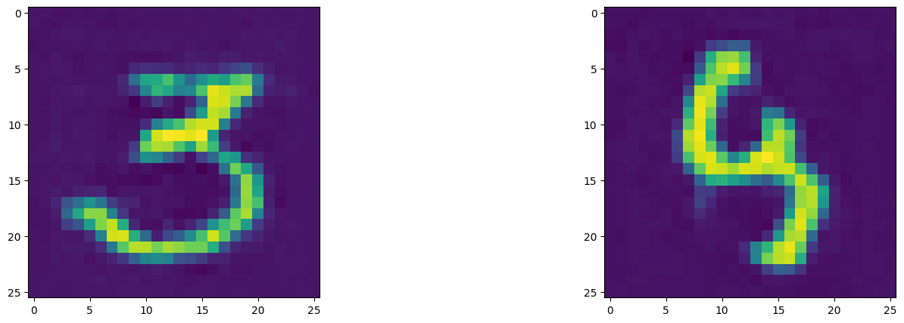

# Generative Adversarial Networks (GANs)

This repository contains an introductory implementation of a Generative Adversarial Network (GAN) built from scratch using Python and deep learning frameworks. The goal is to explore how GANs can learn to generate realistic synthetic data by training two neural networks — a Generator and a Discriminator — in an adversarial setup.

## Project Overview

**Objective:** Learn and experiment with GAN architecture for image generation.

Approach:

* Train a Generator to create fake images from random noise.
* Train a Discriminator to distinguish between real and fake images.
* Improve both networks through adversarial training.

## Key Concepts Covered

* Generator & Discriminator architectures (fully connected / CNN)
* Loss functions for adversarial learning (Binary Cross-Entropy)
* Latent space sampling
* Training stability challenges in GANs

  
